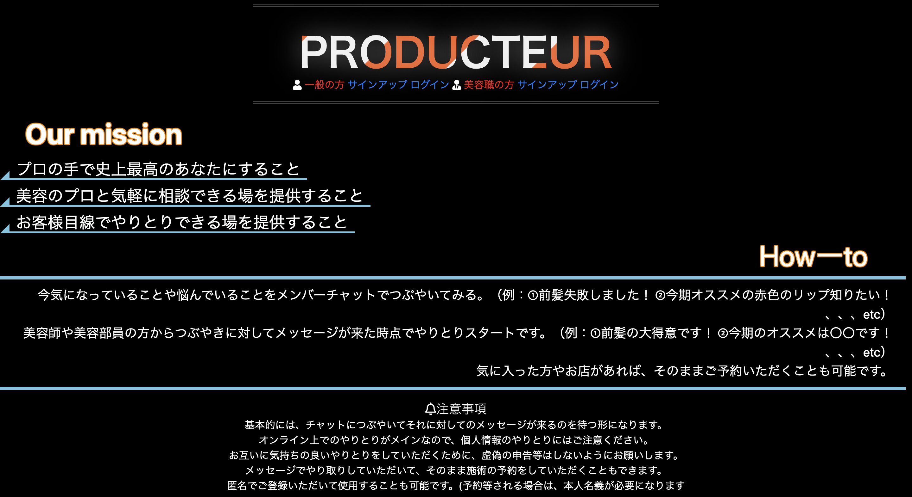

# README

## アプリ名
　Producteur
 
## アプリケーション画面
　

## アプリ概要
　アプリ名はプロデューサーという意味。 
　美容師や美容部員の方々とそのお客さんとなる一般の方を繋ぐアプリケーション。 
　よくある一般の方から予約等をするものではなく、美容職の方々からアプローチをかけられるようにしてある。 
　むしろ、一般の方からのアプローチは出来ないようになっている。 
　お互いにメッセージのやりとりをして気に入れば、そのまま予約等に進むことも出来る。 
　基本的には、予約等をするアプリではなく、髪型やメイクに関する悩み解決がメイン。 
 
## アプリ機能
　新規登録・ログイン機能 
　掲示板チャット機能 
　ユーザー間でのメッセージ機能 
　
## アプリ使用の流れ
### 一般ユーザー
　一般ユーザーとして、ユーザー登録・ログイン。 
　一般の方のつぶやきが集まっている掲示板にアクセス。 
　そこで、髪型やメイクに関する悩みや知りたいことをチャットする。 
　そのチャットに反応のあった美容職ユーザーと直接メッセージのやりとり。 
　オンライン上で疑問が解決すれば良し。気に入れば直接その美容職ユーザーのお店に行くのも良し。 
 
### 美容職ユーザー
　美容職ユーザーとして、ユーザー登録・ログイン。 
　一般の方のつぶやきが集まっている掲示板にアクセス。 
　そこで、解決出来そうなもの・お客さんになりそうなものを見つけたら直接メッセージをしてみる。 
　直接やりとりをしてお店に来ていただけるようにするも良し。オンライン上で解決するも良し。 
 
## 製作背景
　「髪を切りたいから予約する/化粧道具が欲しいから百貨店に行く」ではなく、 
　「〇〇な髪型にしたいけど得意な人いるかな？/●●なメイクしたいけど誰か教えてくれないかな」など、 
　需要の細分化から考えたもの。 
　また、お店や道具だけでなく、人で選ぶ時代だからこそ悩みを拾って直接個人同士で 
　やりとり出来るものを作りたいと考えたから。 
　他のサロン予約サイトは、基本的に店のリストを見てお客さん側が選ぶものですが、Producteurでは逆で発想した。 
　お客さんの悩みを原点に、そこに対して店側がアプローチをするという図を想定して作った。 
 
## 工夫ポイント
　ただチャットをしてやりとりをするのではなく、一般ユーザーのつぶやきをみてそれに反応する形でのみ 
　直接メッセージ出来るようにした。 
　（他の予約サイトとの差別化、あくまでも一般ユーザーの悩みを起点にしたかったから） 
　先入観を持たないようにあえて互いの情報を最低限しか見れないようにしている。 
　（先入観なしで一個人同士でのやりとりをイメージしたため） 
　
## 課題や今後実装したい機能
　・viewをもっと見栄え良く、使いやすいデザインにする 
　・ユーザー検索機能 
　・他の予約サイトとの連携 
　・APIによるユーザー認証 
　、、、etc

